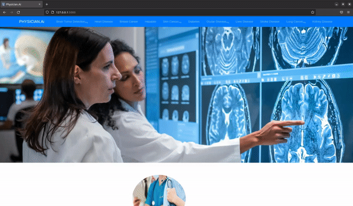

# Introducing DIAGNOMATE.AI: Revolutionizing Healthcare with AI



## About DIAGNOMATE.AI

DIAGNOMATE.AI is a groundbreaking project that harnesses the power of artificial intelligence (AI) to revolutionize healthcare. By leveraging advanced machine learning (ML) and deep learning (DL) algorithms, DIAGNOMATE.AI is designed to assist in the diagnosis and prediction of various diseases, ranging from brain tumors to kidney diseases.

## Tools and Technologies Used
- Visual Studio, Atom, PyCharm, Jupyter Notebook
- Python
- Flask
- Numpy
- Pandas
- Matplotlib
- Seaborn
- Sklearn
- Xgboost
- Joblib
- Pickle
- Tensorflow
- Transfer Learning Algorithms
- OpenCV (cv2)
- PIL
- os


## Features and Applications

### Brain Tumor Detection
- [Brain Tumor Dataset](https://www.kaggle.com/datasets/navoneel/brain-mri-images-for-brain-tumor-detection)
- **Accuracy:** 81%

### Heart Disease Prediction
- [Heart Disease Dataset](https://www.kaggle.com/datasets/johnsmith88/heart-disease-dataset)
- **Accuracy:** 99%

### Breast Cancer Prediction
- [Breast Cancer Dataset](https://www.kaggle.com/datasets/uciml/breast-cancer-wisconsin-data)
- **Accuracy:** 94%

### Hepatitis Disease Prediction
- [Hepatitis Dataset](https://www.kaggle.com/datasets/fedesoriano/hepatitis-c-dataset)
- **Accuracy:** 98%

### Skin Cancer Detection
- [Skin Cancer Dataset](https://www.kaggle.com/datasets/fanconic/skin-cancer-malignant-vs-benign)
- **Accuracy:** 86%

### Diabetes Prediction
- [Diabetes Dataset](https://www.kaggle.com/datasets/mathchi/diabetes-data-set)
- **Accuracy:** 82%

### Ocular Disease Detection
- [Ocular Dataset](https://www.kaggle.com/datasets/andrewmvd/ocular-disease-recognition-odir5k)
- **Accuracy:** 94%

### Liver Disease Prediction
- [Liver Disease Dataset](https://www.kaggle.com/datasets/uciml/indian-liver-patient-records)
- **Accuracy:** 79%

### Stroke Disease Prediction
- [Stroke Disease Dataset](https://www.kaggle.com/datasets/fedesoriano/stroke-prediction-dataset)
- **Accuracy:** 99%

### Lung Cancer Detection
- [Lung cancer Dataset](https://www.kaggle.com/datasets/mohamedhanyyy/chest-ctscan-images)
- **Accuracy:** 86%

### Kidney Disease Prediction
- [Kidney Disease Dataset](https://www.kaggle.com/datasets/mansoordaku/ckdisease)
- **Accuracy:** 97%


## Installation

```bash
pip install -r requirements.txt
```

## How It Works

DIAGNOMATE.AI follows a series of steps:
1. **Import Libraries**: Necessary libraries are imported.
2. **Data Acquisition**: The dataset is obtained.
3. **Exploratory Data Analysis (EDA)**: Various aspects of the dataset are analyzed.
4. **Feature Engineering**: Data preprocessing techniques are applied.
5. **Model Training**: Different ML and DL models are trained.
6. **Model Evaluation**: The performance of each model is evaluated.
7. **Model Deployment**: The best performing model is deployed for real-world use.

## Seeking Opportunities

DIAGNOMATE.AI is actively seeking opportunities for collaboration and implementation in healthcare institutions worldwide. Together, we can leverage the power of AI to transform healthcare delivery and improve patient outcomes.

For more information and collaboration opportunities, feel free to reach out!

**GitHub Repository:** [DIAGNOMATE.AI](https://github.com/Adityasaharan04/DIAGNOMATE.AI)

**LinkedIn:** [Aditya Saharan](https://www.linkedin.com/in/aditya-saharan-10403325a/)

Let's revolutionize healthcare together! 🌟
