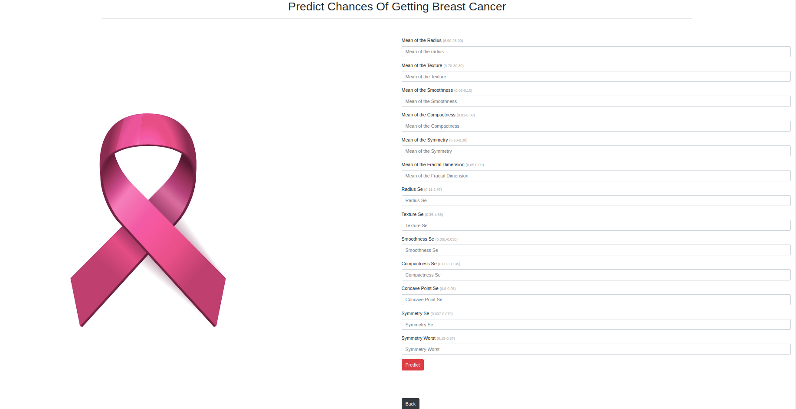
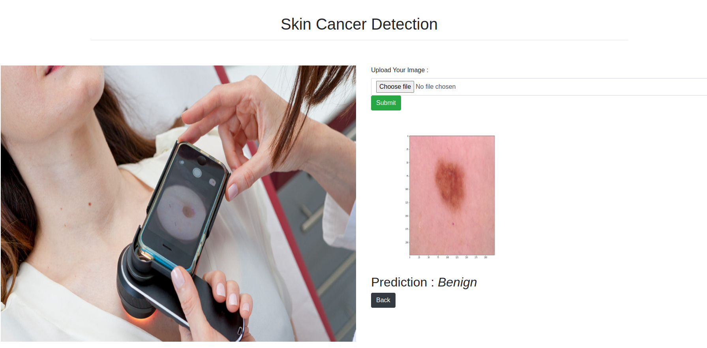
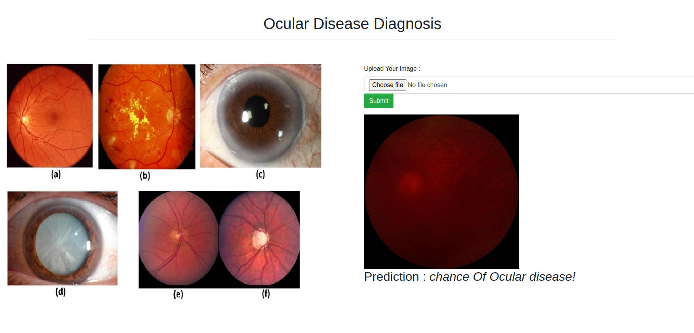
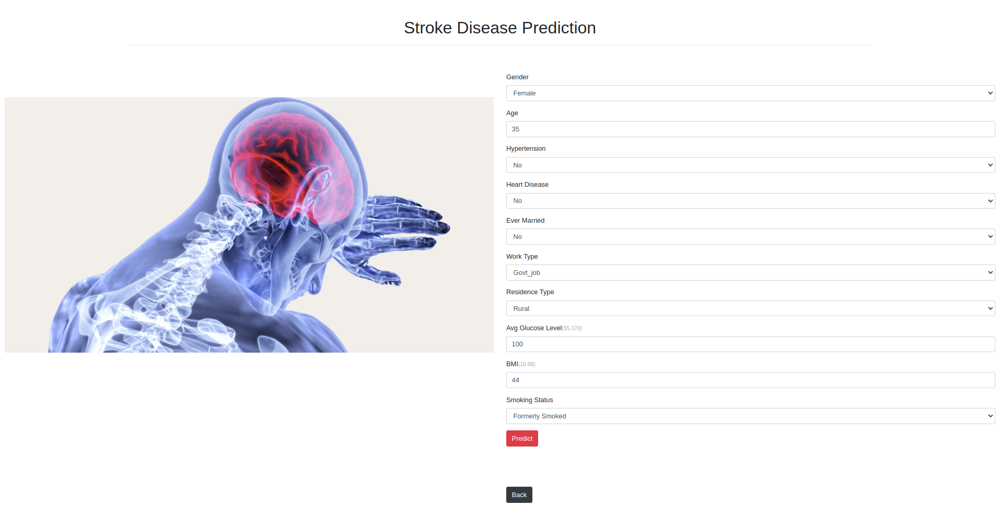
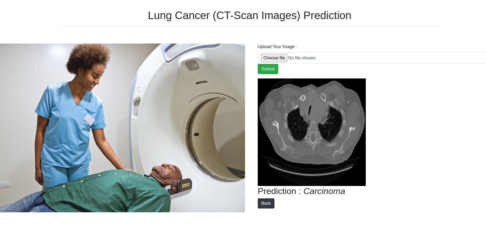
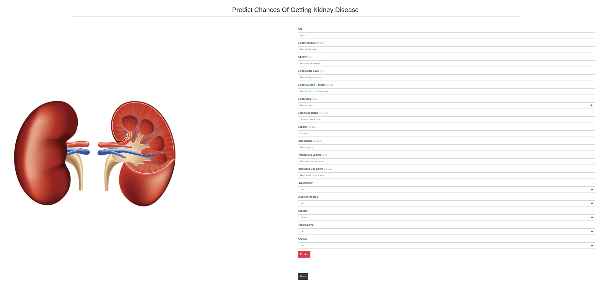

# Introducing DIAGNOMATE.AI: Revolutionizing Healthcare with AI


## About DIAGNOMATE.AI

DIAGNOMATE.AI is a groundbreaking project that harnesses the power of artificial intelligence (AI) to revolutionize healthcare. By leveraging advanced machine learning (ML) and deep learning (DL) algorithms, DIAGNOMATE.AI is designed to assist in the diagnosis and prediction of various diseases, ranging from brain tumors to kidney diseases.

## Tools and Technologies Used
- Visual Studio, Atom, PyCharm, Jupyter Notebook
- Python
- Flask
- Numpy
- Pandas
- Matplotlib
- Seaborn
- Sklearn
- Xgboost
- Joblib
- Pickle
- Tensorflow
- Transfer Learning Algorithms
- OpenCV (cv2)
- PIL
- os


## Features and Applications

------------------------------------------------------------------------
## **Applications**

### Brain Tumor

- [Brain Tumor Dataset](https://www.kaggle.com/datasets/navoneel/brain-mri-images-for-brain-tumor-detection)
- [Jupyter Notebook](https://github.com/FraidoonOmarzai/Physician.Ai/blob/main/Trained%20Model/brain%20tumor/Brain_Tumor.ipynb)
- Accuracy: 81%

  
  <br /><br />

### Heart Disease Prediction

- [Heart Disease Dataset](https://www.kaggle.com/datasets/johnsmith88/heart-disease-dataset)
- [Jupyter Notebook](https://github.com/FraidoonOmarzai/Physician.Ai/blob/main/Trained%20Model/Heart-Model/heart.ipynb)
- Accuracy: 99%

  
  <br /><br />

### Breast Cancer Prediction

- [Breast Cancer Dataset](https://www.kaggle.com/datasets/uciml/breast-cancer-wisconsin-data)
- [Jupyter Notebook](https://github.com/FraidoonOmarzai/Physician.Ai/blob/main/Trained%20Model/breast-cancer/Breast%20Cancer.ipynb)
- Accuracy: 94%

  
  <br /><br />

### Hepatitis Disease Prediction

- [Hepatitis Dataset](https://www.kaggle.com/datasets/fedesoriano/hepatitis-c-dataset)
- [Jupyter Notebook](https://github.com/FraidoonOmarzai/Physician.Ai/blob/main/Trained%20Model/hepatitis/Hepatitis.ipynb)
- Accuracy: 98%

  
  <br /><br />

### Skin Cancer Detection

- [Skin Cancer Dataset](https://www.kaggle.com/datasets/fanconic/skin-cancer-malignant-vs-benign)
- [Jupyter Notebook](https://github.com/FraidoonOmarzai/Physician.Ai/blob/main/Trained%20Model/skin%20cancer/skin_cancer.ipynb)
- Accuracy: 86%

  
  <br /><br />

### Diabetes Prediction

- [Diabetes Dataset](https://www.kaggle.com/datasets/mathchi/diabetes-data-set)
- [Jupyter Notebook](https://github.com/FraidoonOmarzai/Physician.Ai/blob/main/Trained%20Model/Diabet/Diabet.ipynb)
- Accuracy: 82%

  
  <br /><br />

### Ocular Disease Detection

- [Ocular Dataset](https://www.kaggle.com/datasets/andrewmvd/ocular-disease-recognition-odir5k)
- [Jupyter Notebook](https://github.com/FraidoonOmarzai/Physician.Ai/blob/main/Trained%20Model/ocular/OcularDisease.ipynb)
- Accuracy: 94%

  
  <br /><br />

### Liver Disease Prediction

- [Liver Disease Dataset](https://www.kaggle.com/datasets/uciml/indian-liver-patient-records)
- [Jupyter Notebook](https://github.com/FraidoonOmarzai/Physician.Ai/blob/main/Trained%20Model/liver/liver.ipynb)
- Accuracy: 79%

  
  <br /><br />

### Stroke Disease

- [Stroke Disease Dataset](https://www.kaggle.com/datasets/fedesoriano/stroke-prediction-dataset)
- [Jupyter Notebook](https://github.com/FraidoonOmarzai/Physician.Ai/blob/main/Trained%20Model/stroke/Stroke.ipynb)
- Accuracy: 99%

  
  <br /><br />

### Lung Cancer

- [Lung cancer Dataset](https://www.kaggle.com/datasets/mohamedhanyyy/chest-ctscan-images)
- [Jupyter Notebook](https://github.com/FraidoonOmarzai/Physician.Ai/blob/main/Trained%20Model/ct%20scan%20lung%20cancer/chest_ct_scan_image.ipynb)
- Accuracy: 86%

  
  <br /><br />

### Kidney Disease Prediction

- [Kidney Disease Dataset](https://www.kaggle.com/datasets/mansoordaku/ckdisease)
- [Jupyter Notebook](https://github.com/FraidoonOmarzai/Physician.Ai/blob/main/Trained%20Model/kidney/kidney.ipynb)
- Accuracy: 97%

  
  <br /><br />


------------------------------------------------------------------------

## Used Tools And Technology

- Visual Studio, Atom, PyCharm, Jupyter Notebook
- Python
- Flask
- Numpy
- Pandas
- Matplotlib
- Seaborn
- Sklearn
- ML Algorithms
- Xgboos
- Joblib
- Pickle
- Tensorflow
- Transfer Learning Algorithms
- cv2
- PIL
- os


## Installation

```bash
  pip install -r requirements.txt
```
------------------------------------------------------------------------
## Steps Involeved In Projects

- Import libraries
- Get the Dataset
- EDA
  - Check The dataset rows and columns along with data types
  - Check the null values
  - Check whether balance or imbalance dataset
  - Check the outliers
  - Check the relationship of features
- Feature Engineering
  - Handling missing values
  - Handling imbalance dataset
  - Handling outliers
- Feature Selection
- Train different Model and select the best one
- Test the model
- Save the model
## Installation

```bash
pip install -r requirements.txt
```

## How It Works

DIAGNOMATE.AI follows a series of steps:
1. **Import Libraries**: Necessary libraries are imported.
2. **Data Acquisition**: The dataset is obtained.
3. **Exploratory Data Analysis (EDA)**: Various aspects of the dataset are analyzed.
4. **Feature Engineering**: Data preprocessing techniques are applied.
5. **Model Training**: Different ML and DL models are trained.
6. **Model Evaluation**: The performance of each model is evaluated.
7. **Model Deployment**: The best performing model is deployed for real-world use.

## Seeking Opportunities

DIAGNOMATE.AI is actively seeking opportunities for collaboration and implementation in healthcare institutions worldwide. Together, we can leverage the power of AI to transform healthcare delivery and improve patient outcomes.

For more information and collaboration opportunities, feel free to reach out!

**GitHub Repository:** [DIAGNOMATE.AI](https://github.com/Adityasaharan04/DIAGNOMATE.AI)

**LinkedIn:** [Aditya Saharan](https://www.linkedin.com/in/aditya-saharan-10403325a/)

Let's revolutionize healthcare together! 🌟
